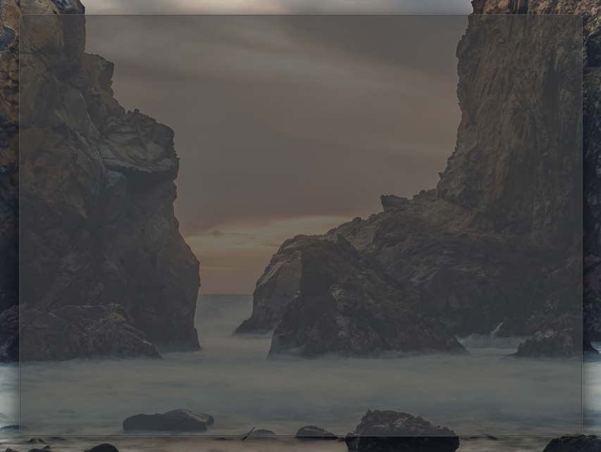
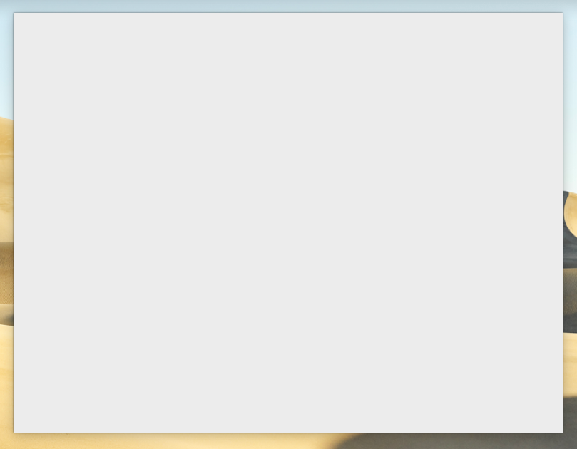

> [!warning]
> # ARCHIVE NOTICE
> 
> This crate is **Unmaintained**! it served its purpose which was an interim solution to enable shadows on undecorated windows for `tao` and `tauri`.
> 
> As of `tauri@v2` and recent versions of `tao` and `winit`, they all support enablind/disabling shadows so this crate is not needed.
>
> If you're using `tauri@v1` and need this crate, don't worry, this crate will still function with `tauri@v1` without any problems.


# window-shadows

[](https://crates.io/crates/window-shadows) [](https://docs.rs/window-shadows/) 
[](https://discord.gg/SpmNs4S)

Add native shadows to your windows.

## Platform-specific

- **Windows**: On Windows 11, the window will also have rounded corners.
- **macOS**: Shadows are always disabled for transparent windows.
- **Linux**: Unsupported, Shadows are controlled by the compositor installed on the end-user system.

## Example

```rs
use window_shadows::set_shadow;

#[cfg(any(windows, target_os = "macos"))]
set_shadow(&window, true).unwrap();
```

## Screenshots

<p align="center">

| Windows | macOS |
| :---:   | :---: |
|  |  |

</p>
